# Human Machine Interface for Accurate Demonstrations of Mobile Robots Motions

**Master Thesis. Learning from Demonstration for mobile robot navigation, using body gestures as the command modality.**

**Author:** Fatemeh Javadian

**Supervisors:** Prof. Dr. Frank Hoffmann

**Institution:** Lehrstuhl für Regelungs Systemtechnik (RST), Fakultät ET / IT, Technische Universität Dortmund

Licensed under the Creative Commons Attribution-NonCommercial-NoDerivatives 4.0 International license. See LICENSE. Copyright (c) Javadian. All rights reserved.

  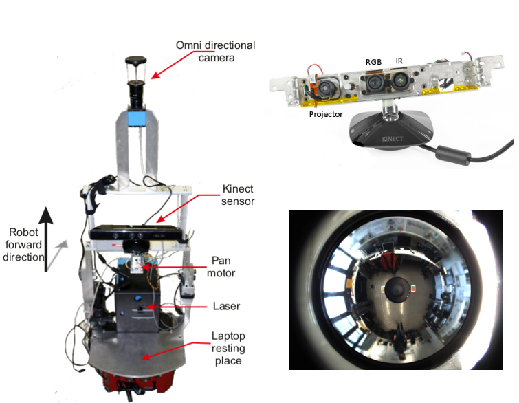

A human walks behind a mobile robot and drives it by turning a hypothetical steering wheel in the air. An RGB-D camera on an actuated pan head watches the human, a skeleton tracker extracts the joints, and the resulting gesture is mapped in real time to the translational and rotational velocity of a differential drive base. The purpose is not teleoperation for its own sake. It is to **generate high fidelity training data for Learning from Demonstration**, where the quality of the demonstration, not the learning algorithm, is what limits generalization.

---

## Vision-Gesture learning model vs VLA

**Structurally, this is the same problem that vision-language-action models address.** The system takes a perceived instruction together with the current scene and maps them to a robot action, closed in a real-time loop on physical hardware. The only substitution is the command modality: **gestures instead of language.**

| This work | VLA |
|---|---|
| Gesture command captured by RGB-D, mapped to `(v, ω)` | **Vision-language-action**: instruction plus scene mapped to action |
| Human demonstrates, robot records its own perception-action pairs | **Imitation learning**, demonstration data collection |
| Actuated pan head moves the sensor to keep the instruction observable | **Active perception** |
| Teacher intent versus what the robot can actually perceive | **Human-robot cognitive alignment**, the correspondence problem |
| Ultrasonic time-to-collision sensors override on top of the learned command | **Safety layer over a learned policy** |

Two conclusions from this project that carried forward:

- **Moving a sensor to obtain a more informative observation is part of the system design, not an accident of the hardware.** The pan axis exists because the demonstration is unusable the moment the teacher leaves the field of view. That is active perception, arrived at from necessity.
- **The effectiveness of the whole system is bounded by whether the control loop closes within the required time.** Every design decision in the perception pipeline was ultimately a latency decision.

---

## What was built

Three demonstration interfaces were implemented and compared on identical navigation tasks: a **joystick** with direct velocity mapping, **gesture based demonstration** with the robot observing the teacher, and **steering wheel teleoperation** where the operator sees only the robot's own omnidirectional camera stream.

  

These three are not just different input devices. They differ in **record mapping**, that is, in how the teacher's action corresponds to the robot's recorded action. The joystick is an identity mapping. The gesture interface is an indirect mapping and a case of shadowing, since teacher and robot have different degrees of freedom. Teleoperation removes the mismatch between what the teacher sees and what the robot sees, at the cost of removing depth perception from the teacher.

The gesture interface is the main contribution of the thesis and the bulk of the implementation work.

---

## Perception and control pipeline

  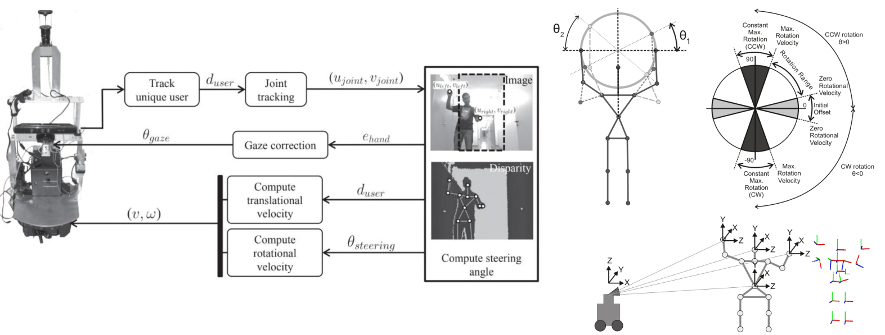

**Full pipeline implemented end to end on the robot:**

1. **RGB-D perception.** Kinect mounted on the rear of the base, facing the demonstrator. Depth and RGB at 640 x 480, 30 Hz.
2. **Skeleton tracking.** Five joint frames tracked: head, neck, torso, left hand, right hand.
3. **Coordinate frame transformation.** Joint poses arrive as `tf` transforms relative to the camera depth frame, with orientation in quaternions. These are transformed and then projected from 3D camera coordinates into the 640 x 480 image plane through a pinhole camera model with the intrinsic calibration matrix.
4. **Gesture feature extraction.** The steering angle is computed in image coordinates, not metric coordinates, because the metric extent of the camera frame changes with distance and is not a stable reference.
5. **Velocity mapping.** Steering angle to rotational velocity, teacher distance to translational velocity.
6. **Gaze control.** Image-based visual servoing on an external pan servo, plus a one-shot tilt computation.
7. **Safety override.** Sonar-derived time to collision caps the commanded velocity.
8. **Synchronised multi-sensor logging** of everything above for offline analysis.

  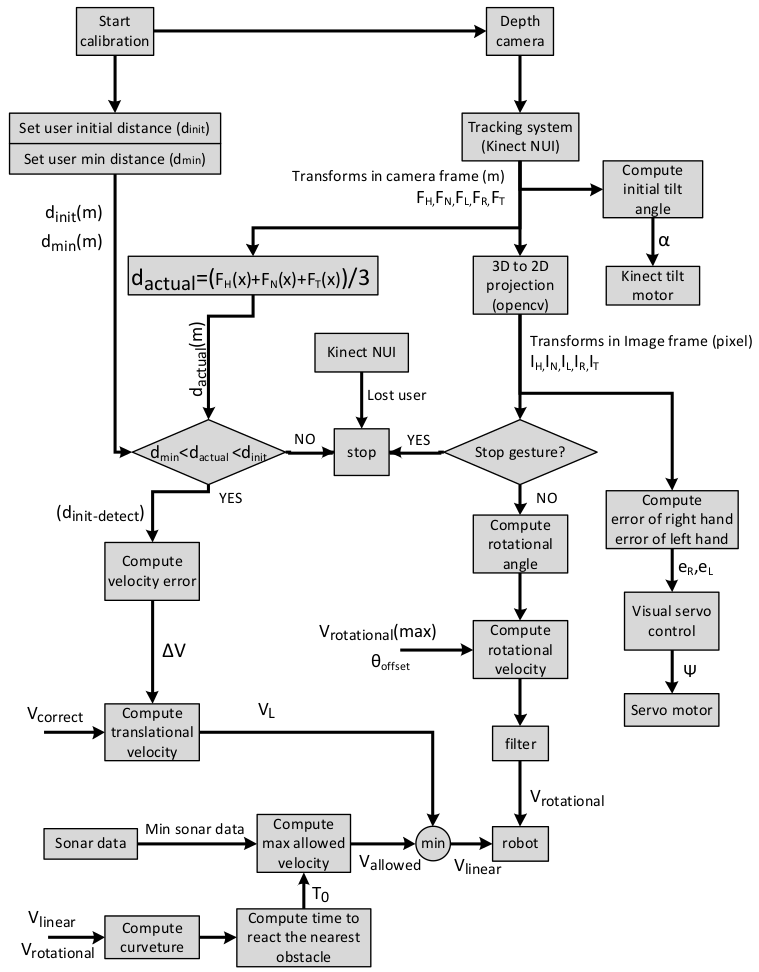

### Coordinate frames and projection

Every gesture feature lives in image space, so the chain from the depth sensor to the pixel plane had to be correct and cheap to evaluate every cycle.

  

  

### The steering gesture

The command gesture deliberately reuses an existing human motor skill. **The teacher turns an imaginary steering wheel and the robot turns the same way.** No controller, no training, no interface to learn.

  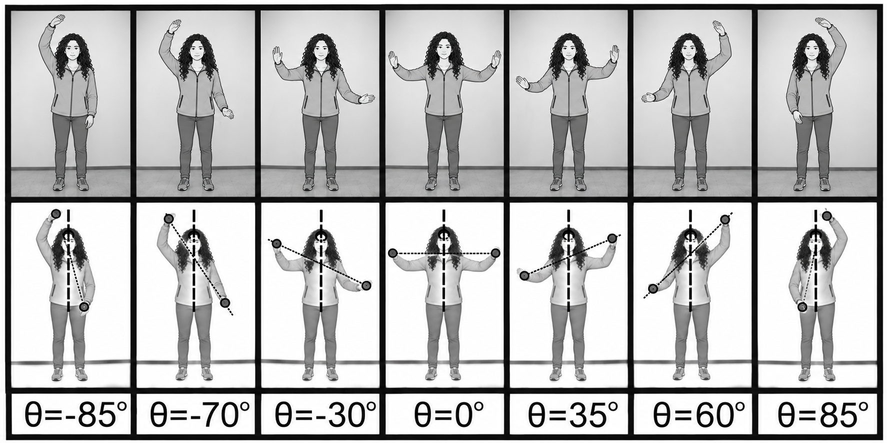

The steering angle is the angle between the **body line** through head, neck and torso, and the **hand line** through left and right hand. The PSI calibration pose, where the two lines are perpendicular, defines zero.

  

A minimum offset suppresses tracker noise and small unintended movement. A maximum offset clamps the range so a large gesture cannot command an unsafe rotation. What remains maps linearly to rotational velocity, then passes a mean filter of order five before it reaches the base.

### Translational velocity from proxemics

**The robot holds the distance to the teacher that was measured at calibration.** Walking forward closes the gap and the robot accelerates. Stopping restores the gap and the robot stops. The robot therefore reproduces the teacher's own walking pattern rather than an abstract velocity command. A proportional feedback loop on the distance error drives the correction. The robot halts entirely if the teacher gets closer than 30 percent of the reference distance, or if tracking is lost. Robust tracking held over roughly **1.5 to 3.5 metres**.

### Active perception: the pan head

The Kinect has a narrow horizontal field of view. The teacher moves, the robot rotates, and the demonstration is destroyed the instant the teacher leaves frame. **The camera was therefore mounted on an external servo and driven by image-based visual servoing**, using the image Jacobian to convert the pixel error into a pan rate.

The error is taken from the **left and right hand positions** rather than the head, because measurement showed the head frame was substantially noisier than the hand frames in this tracker. The two hand errors are averaged into a single correcting angle and written to the servo over a serial link, with travel limited to plus or minus 90 degrees. Tilt is computed once after calibration by triangulation on the head position, so that the teacher is vertically centred before the demonstration begins.

### Bidirectional feedback to the human

The interface is not one-way. Audio messages announce state changes and obstacle warnings, and a live view shows the teacher **what the robot currently believes about them**: tracked joint positions, whether they are inside the desired image region, and the velocities being applied right now.

  

This closes the loop on the human side and is what let non-experts correct their own gestures instead of being told how to stand. It measurably shortened preparation time.

---

## System

  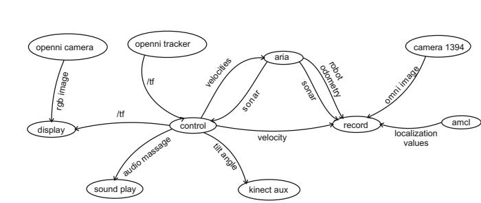

**Three custom ROS nodes:**

| Node | Responsibility |
|---|---|
| `control` | Main loop. Calibration, transform subscription, gesture feature extraction, velocity computation, gaze commands, audio cues, recording trigger |
| `record` | Synchronised logging: sonar, omnidirectional images, pan angles, localization, odometry, teacher distance, gesture state, all system-time tagged |
| `display` | Live operator feedback view |

**Integrated stock packages:** `openni_camera`, `openni_tracker`, `kinect_aux`, `sound_play`, `amcl` for Monte Carlo localization, `ROSARIA` for velocities, odometry and sonar, `camera1394` for the omnidirectional camera, `image_view` and `rviz`. Everything is brought up from one launch file.

**Hardware:** Pioneer 3-DX differential drive base, Microsoft Kinect, HS-645MG servo with a Pololu Mini Maestro 12 controller for the pan axis, Kinect internal tilt motor, sonar ring, laser scanner for mapping and localization, catadioptric omnidirectional camera over FireWire, onboard laptop.

**Stack:** C++ on ROS for everything real time, MATLAB for offline analysis of the recorded demonstrations.

### Omnidirectional imaging for the teleoperation mode

The third interface streams the robot's own catadioptric image to a remote operator. Raw omnidirectional images are hard for humans to navigate from, so the image is **unwarped into a bird's-eye view by radial correction around the image centre**, which restores geometric consistency. Corridors then appear as bands of constant width.

  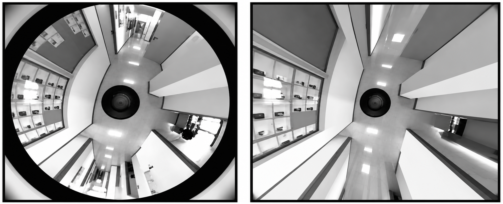

  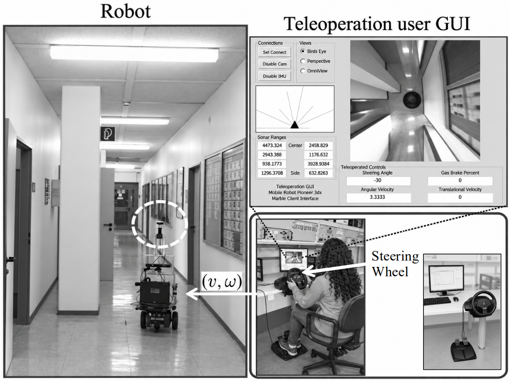

Image data and motion commands travel over a TCP/IP client-server link. Loss of communication beyond a timeout stops the robot.

---

## Experiments

**Seven navigation behaviors** were demonstrated in a real office building, not in simulation: straight line, curved line, slalom, corridor following, obstacle avoidance, door passing and homing.

  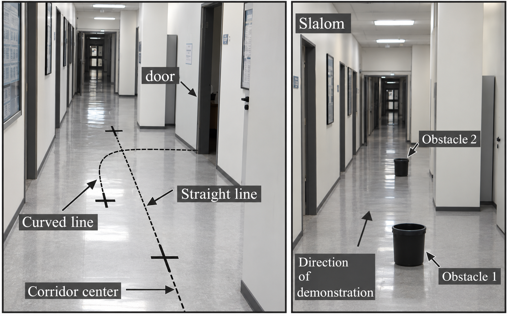

**Fifteen volunteers** with varying levels of programming and robotics knowledge participated, each given at most ten minutes to become acquainted with all three interfaces. Conditions were checked before every run to keep them comparable across users. Laser-based Monte Carlo localization provided absolute robot coordinates in the map, and odometry was logged in parallel.

**Performance measures:** average time to complete the task, total number of velocity commands, average translational velocity, average curvature of the demonstrated trajectory, and the dispersion of the curvature distribution as a smoothness measure. Curvature is the ratio of commanded rotational to translational velocity, which decouples the shape of the demonstration from the speed at which it was performed and lets fast and slow runs be compared directly.

---

## Results

### Time to complete the task

  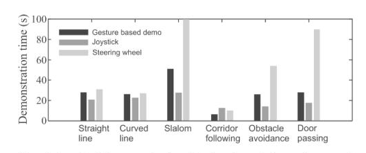

### Number of commands issued

  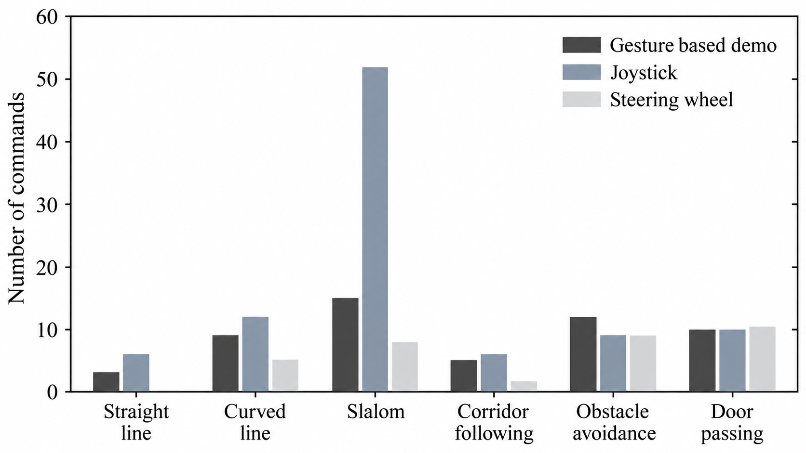

### Smoothness of the recorded demonstrations

  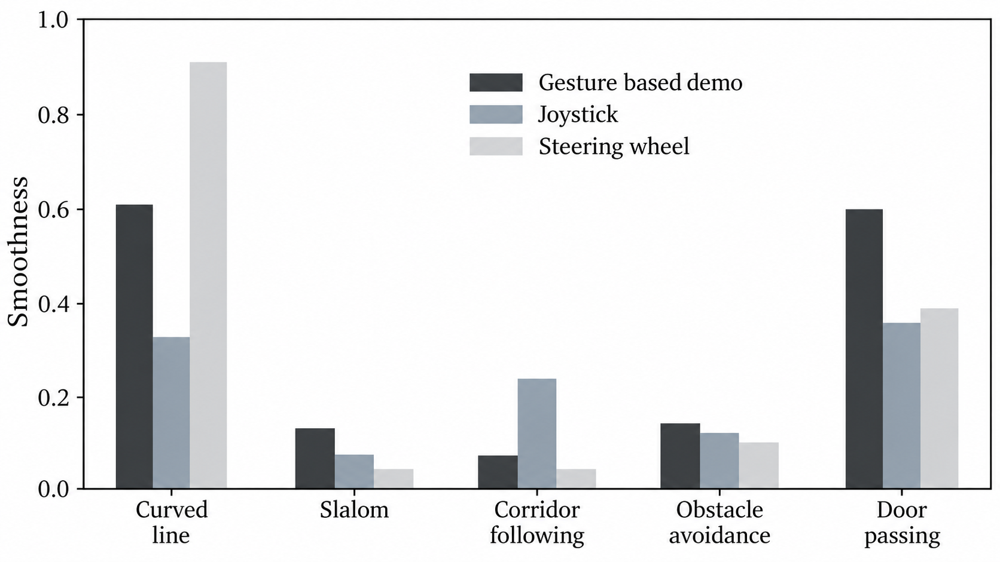

**What the numbers say:**

- **The gesture interface produced the least noisy demonstration data of the three.** Since the point of the exercise is training data for Learning from Demonstration, this is the result that matters most.
- **Joystick demonstrations were the noisiest.** Holding a translational velocity steady while simultaneously applying rotation is something humans do badly with a joystick, and non-experts degrade sharply. Joystick is the fastest interface to pick up, and the fastest to finish a task, but not the one that produces the best data.
- **Steering wheel teleoperation was consistently the slowest**, especially on medium complexity behaviors like slalom and door passing, because the operator has no direct view of the robot and no depth cue from the camera image.
- **Gesture demonstration performed consistently well even with non-experts**, after a short preparation period.

Participants also rated the three interfaces after their sessions. **The gesture interface was rated the most enjoyable to use by a large margin**, while the joystick was rated easiest to pick up. Enjoyment is not a trivial finding here: demonstration data collection depends on human participants being willing to keep going.

  

<b>Detailed per-behavior tables from the thesis</b>

 

These tables are taken from the thesis, which reports selected demonstrations per behavior. The bar plots above aggregate over the full participant group, so the two sets of figures are not directly comparable.

Average completion time in seconds:

| Behavior | Joystick | Steering wheel | Gesture HRI |
|---|---|---|---|
| Straight line | 9.91 | 76.42 | 26.88 |
| Curve line | 5.0 | 9.43 | 31.0 |
| Slalom | 28.8 | 24.4 | 53.15 |
| Corridor following | 62.80 | 148.51 | 59.65 |
| Obstacle avoidance | 11 | 51.7 | 37.7 |
| Homing | 24.73 | 48.14 | 24.97 |
| Door passing | 29.8 | 77 | 30.77 |

Average number of commands:

| Behavior | Joystick | Steering wheel | Gesture HRI |
|---|---|---|---|
| Straight line | 1 | 1 | 3 |
| Curve line | 5 | 5 | 8.6 |
| Slalom | 8 | 52 | 14.5 |
| Corridor following | 5 | 22 | 45 |
| Obstacle avoidance | 9.5 | 9 | 11.4 |
| Homing | 5.3 | 10 | 2.25 |
| Door passing | 7.6 | 10.5 | 10 |

Joystick figures are for expert users. Where non-expert results diverged sharply the thesis reports them separately: corridor following took 283.7 seconds for non-experts against 62.80 for experts, and curved line took 13.0 against 5.0.

Variance of the curvature distribution, lower meaning a smoother path:

| Behavior | Joystick (expert) | Joystick (non-expert) | Steering wheel | Gesture HRI |
|---|---|---|---|---|
| Straight line | 0 | | 0 | 28.5 |
| Curve line | 5191 | 1923 | 958 | 364 |
| Slalom | 231 | | 2429 | 758 |
| Corridor following | 432 | 10723 | 654 | 575 |
| Obstacle avoidance | 13396 | | 47360 | 10520 |
| Door passing | 2301 | | 2399 | 2542 |

---

## What this project demonstrates

- **Complete robotics pipeline delivered on physical hardware**, from RGB-D perception through coordinate transformations, feature extraction and control, to a moving differential drive base, with no simulation stage in between.
- **Real-time closed-loop control** under the latency budget of a 30 Hz sensor, including an inner visual servoing loop on the camera pan axis.
- **Image-based visual servoing** implemented from the image Jacobian, not taken from a library.
- **Multi-sensor integration**: RGB-D, laser, sonar, wheel odometry, catadioptric camera, servo feedback, on one platform under ROS.
- **Sensor characterisation driving design**, for example measuring that head-frame tracking was less reliable than hand-frame tracking and reworking the gaze error around that instead of trusting the API.
- **Safety layer independent of the command source**, so a wrong or malicious command cannot drive the robot into an obstacle.
- **Experiment design and user study** with fifteen participants, quantitative metrics, and a questionnaire, followed by statistical analysis of the recorded runs.
- **Framing a human-robot interaction problem as a data quality problem**, which is the correct framing for imitation learning.

---

## Related publication

This thesis formed the basis of the following publication by the institute, where the gesture-based demonstration mode,
including its implementation and experimental evaluation, was developed within the scope of this work, the paper draws on the work in this thesis, and the thesis is the primary and complete record of it.

> _K.K. Narayanan, L.F. Posada, F. Hoffmann and T. Bertram, “Human-Machine Interfaces for Intuitive and
Effective Demonstrations of Mobile Robot Behaviors,” in Proceedings of the 22. Workshop Computational
Intelligence, KIT Scientific Publishing, Dortmund, 2014, Band 45, p. 427._

---

## Repository contents

_Source files are being added. This section will list them once the upload is complete._

---
## License
**License:** CC BY-NC-ND 4.0 — https://creativecommons.org/licenses/by-nc-nd/4.0/ See `LICENSE`.
