# Vision-Gesture Learning in Human Machine Interface for Accurate Demonstrations of Mobile Robots Motions

**Master Thesis. Learning from Demonstration for mobile robot navigation, using body gestures as the command modality.**

**Author:** Fatemeh Javadian

**Supervisors:** Prof. Dr. Frank Hoffmann

**Institution:** Lehrstuhl für Regelungs Systemtechnik (RST), Fakultät ET / IT, Technische Universität Dortmund


Licensed under the Creative Commons Attribution-NonCommercial-NoDerivatives 4.0 International license. See LICENSE.


## Description

This project develops an intuitive human-machine interface for generating high-quality training demonstrations for Learning from Demonstration on a mobile robot. The interface allows a human demonstrator to control the robot through natural steering gestures, without using a physical controller. An RGB-D camera mounted on an actuated pan head observes the demonstrator, a skeleton-tracking pipeline extracts the relevant body joints, and the detected gestures are mapped in real time to the translational and rotational velocities of a differential-drive mobile base.

The central objective is not teleoperation itself, but the acquisition of accurate and consistent demonstration data, so it is to **generate high fidelity training data for Learning from Demonstration**. In Learning from Demonstration, the quality of the demonstrations directly affects the behavior that can be learned and its ability to generalize. The system therefore focuses on providing an intuitive and responsive interaction mechanism that enables the demonstrator to generate reliable motion examples while remaining naturally engaged with the robot and its environment.

### System and platform
Hardware: Pioneer 3DX differential-drive
robot, onboard laptop, Kinect (RGB-D) on an
actuated pan head, 360° omnidirectional camera,
sonar ring, laser scanner.

Tools: ROS, OpenNI skeletal tracking, TF
transform tree, OpenCV, C++, with real-time
velocity-command generation and synchronized
multi-sensor data logging.

<table>
  <tr>
    <td>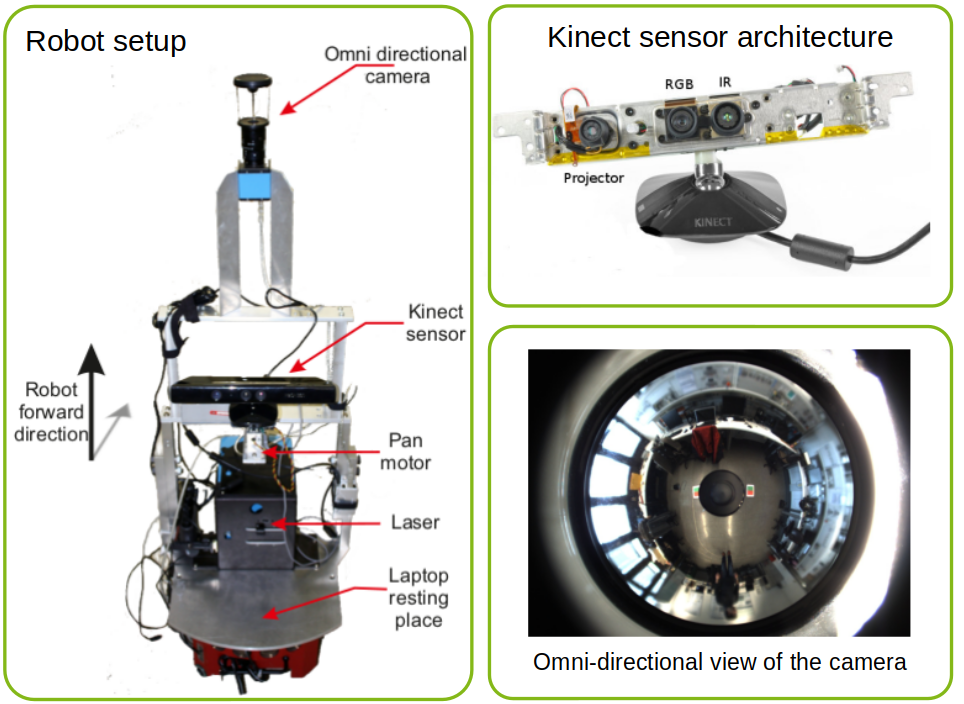</td>
    <td rowspan="2">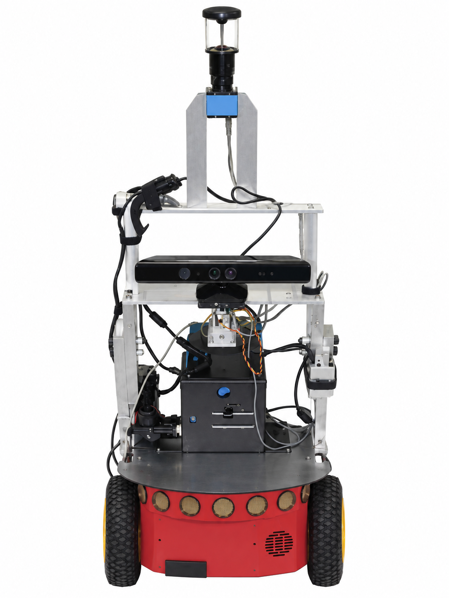</td>
  </tr>
  <tr>
    <td>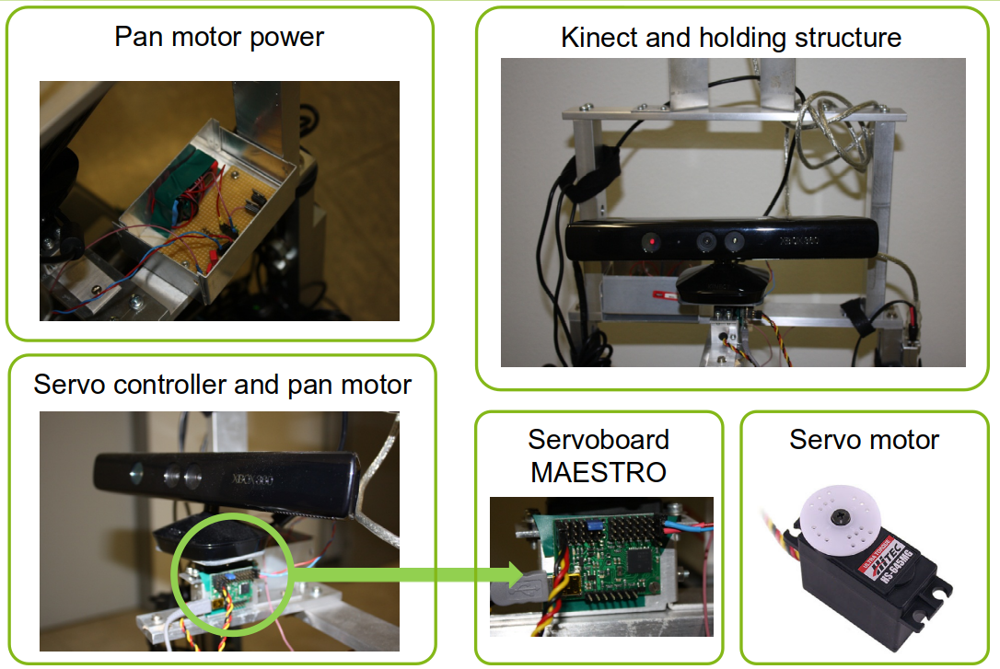</td>
  </tr>
</table>


---

## Vision-Gesture learning model vs VLA

From a system-level perspective, the project follows the same basic formulation as modern vision-language-action models. A perceived instruction is combined with information about the current scene and translated into a robot action, with the entire perception-to-action pipeline running as a closed real-time loop on physical hardware. The main difference lies in the instruction modality: the command is expressed through gestures rather than language.

| This work | VLA |
|---|---|
| Gesture command captured by RGB-D, mapped to `(v, ω)` | **Vision-language-action**: instruction plus scene mapped to action |
| Human demonstrates, robot records its own perception-action pairs | **Imitation learning**, demonstration data collection |
| Actuated pan head moves the sensor to keep the instruction observable | **Active perception** |
| Teacher intent versus what the robot can actually perceive | **Human-robot cognitive alignment**, the correspondence problem |
| Ultrasonic time-to-collision sensors override on top of the learned command | **Safety layer over a learned policy** |


The project also led to two broader design principles that remain relevant to my later work:

- **Moving a sensor to obtain a more informative observation is part of the system design, not merely a consequence of the hardware.** The pan axis is necessary because the demonstration becomes unusable once the teacher leaves the camera's field of view. In this system, active perception therefore emerges directly from a practical requirement.
- **The overall system is only as effective as the real-time control loop it can sustain.** Every decision in the perception pipeline ultimately had to account for latency and whether the full loop could be closed within the required time.
---

## Demonstration modes

Three demonstration interfaces were implemented and compared on identical navigation tasks: a **joystick** with direct velocity mapping, **gesture based demonstration** with the robot observing the teacher, and **steering wheel teleoperation** where the operator sees only the robot's own omnidirectional camera stream.

<p align="center">
  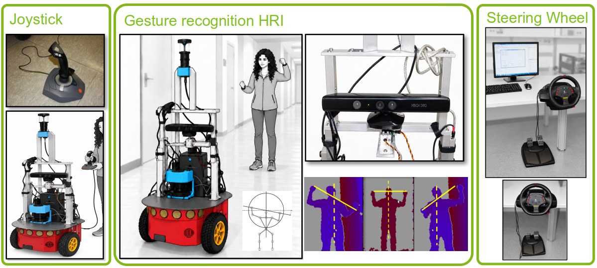
</p>

These three are not just different input devices. They differ in **record mapping**, that is, in how the teacher's action corresponds to the robot's recorded action. The joystick is an identity mapping. The gesture interface is an indirect mapping and a case of shadowing, since teacher and robot have different degrees of freedom. Teleoperation removes the mismatch between what the teacher sees and what the robot sees, at the cost of removing depth perception from the teacher.

The gesture interface is the main contribution of the thesis and the bulk of the implementation work.

---

## Perception and control pipeline

<p align="center">
  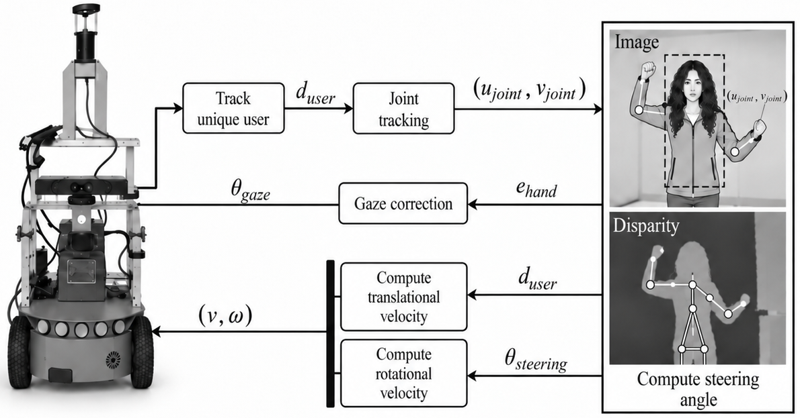
</p>

**Full pipeline implemented end to end on the robot:**

1. **RGB-D perception.** Kinect mounted on the rear of the base, facing the demonstrator. Depth and RGB at 640 x 480, 30 Hz.
2. **Skeleton tracking.** Five joint frames tracked: head, neck, torso, left hand, right hand.
3. **Coordinate frame transformation.** Joint poses arrive as `tf` transforms relative to the camera depth frame, with orientation in quaternions. These are transformed and then projected from 3D camera coordinates into the 640 x 480 image plane through a pinhole camera model with the intrinsic calibration matrix.
4. **Gesture feature extraction.** The steering angle is computed in image coordinates, not metric coordinates, because the metric extent of the camera frame changes with distance and is not a stable reference.
5. **Velocity mapping.** Steering angle to rotational velocity, teacher distance to translational velocity.
6. **Gaze control.** Image-based visual servoing on an external pan servo, plus a one-shot tilt computation.
7. **Safety override.** Sonar-derived time to collision caps the commanded velocity.
8. **Synchronised multi-sensor logging** of everything above for offline analysis.

<p align="center">
  
</p>

### Coordinate frames and camera projection

Every gesture feature lives in image space, so the chain from the depth sensor to the pixel plane had to be correct and cheap to evaluate every cycle.


<p align="center">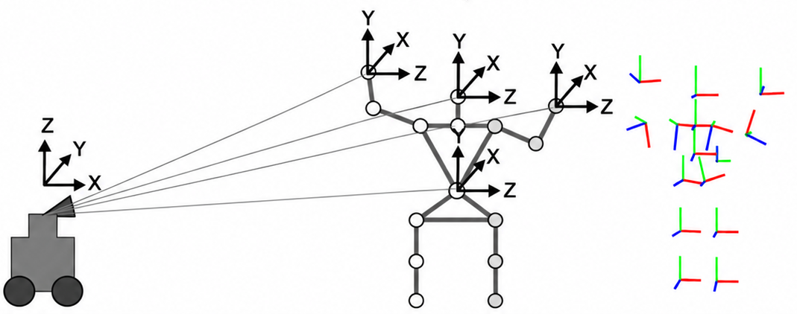 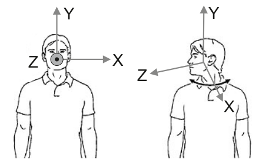</p>

<p align="center">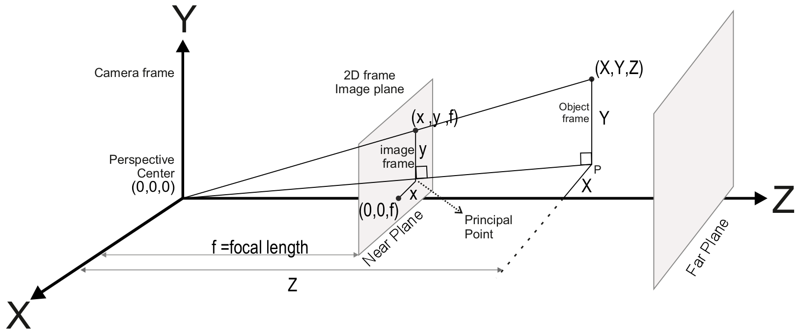 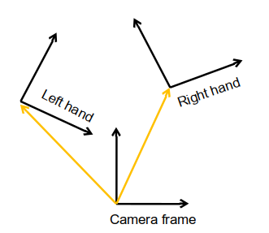</p>

3D camera coordinates project onto the 2D image plane through a pinhole model. For a point $(X,Y,Z)$ with focal length $f$:
 
$$
\begin{pmatrix} x \\\\ y \\\\ f \end{pmatrix} = \frac{f}{Z} \cdot \begin{pmatrix} X \\\\ Y \\\\ Z \end{pmatrix}
$$
 
Written as a linear transform on homogeneous coordinates $(u,v,w)$:
 
$$
\begin{pmatrix} v \\\\ u \\\\ w \end{pmatrix} = \begin{pmatrix} f & 0 & 0 & 0 \\\\ 0 & f & 0 & 0 \\\\ 0 & 0 & 1 & 0 \end{pmatrix} \cdot \begin{pmatrix} X \\\\ Y \\\\ Z \\\\ 1 \end{pmatrix}, \qquad
\begin{cases} x = \dfrac{u}{w} = f\dfrac{X}{Z} \\\\[4pt] y = \dfrac{v}{w} = f\dfrac{Y}{Z} \end{cases}
$$
 
The camera coordinate frame is used directly as the reference frame, since it moves with the robot and all distances and velocities are relative to it, so no extrinsic calibration matrix is needed. The intrinsic calibration matrix (camera matrix) $\Omega$ maps a 3D point $\vec{V}$ in camera coordinates to the pixel coordinate frame $\vec{p} = (x,y,1)^T$:
 
$$
\vec{p} = \frac{1}{f}\Omega\vec{V}
$$
 
If lens distortion is not negligible, a tangential distortion term $\vartheta$ and a radial term are applied first. With $r^2 = x^2+y^2$ and distortion coefficients $l_{(1)}\ldots l_{(5)}$:
 
$$
\vartheta = \begin{pmatrix} 2l_{(3)}xy + l_{(4)}(r^2+2x^2) \\\\ l_{(3)}(r^2+2x^2) + 2l_{(4)}xy \end{pmatrix}
$$
 
$$
\begin{pmatrix} x' \\\\ y' \end{pmatrix} = \left(1 + l_{(1)}r^2 + l_{(2)}r^4 + l_{(5)}r^6\right)\begin{pmatrix} x \\\\ y \end{pmatrix} + \vartheta
$$
 
In this system lens distortion was found to be close to zero and was ignored, so the final pixel coordinates come directly from the intrinsic matrix:
 
$$
\begin{pmatrix} x \\\\ y \\\\ 1 \end{pmatrix} = \Omega \cdot \begin{pmatrix} x' \\\\ y' \\\\ 1 \end{pmatrix}, \qquad
\Omega = \begin{pmatrix} f_x & k f_x & O_x \\\\ 0 & f_y & O_y \\\\ 0 & 0 & 1 \end{pmatrix}
$$
 
$k$ is the pixel skew coefficient. This is the transform used to turn the five tracked joint positions (head, neck, torso, left hand, right hand) from the 3D camera frame into the 640x480 image frame used for every gesture feature below.
<p align="center">
  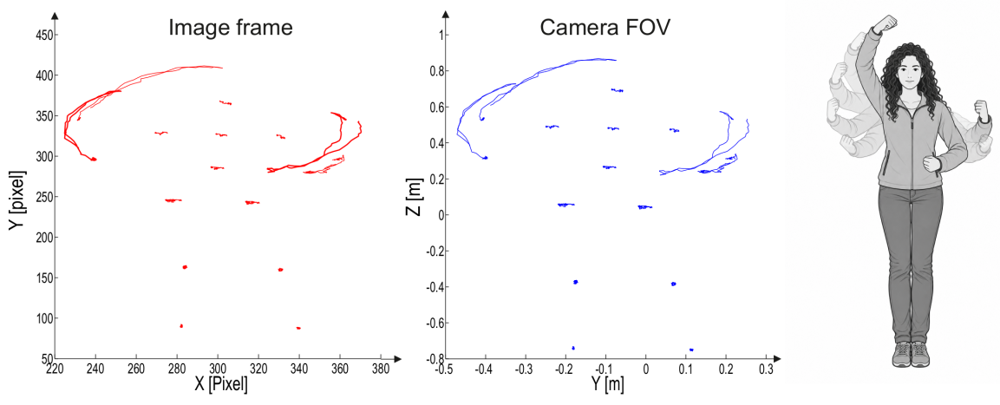
</p>

### The steering gesture

The command gesture deliberately reuses an existing human motor skill. **The teacher turns an imaginary steering wheel and the robot turns the same way.** No controller, no training, no interface to learn.

<p align="center">
  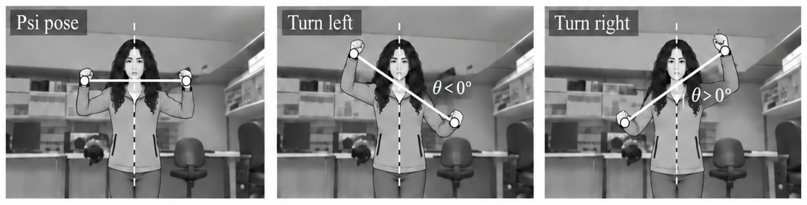
</p>

The steering angle is the angle between the **body line** through head, neck and torso, and the **hand line** through left and right hand. The PSI calibration pose, where the two lines are perpendicular, defines zero.

#### Kinematic model
The robot is modelled as a standard unicycle. With position $(x,y)$ and heading $\gamma$, translational velocity $V$ and rotational velocity $\omega$:
 
$$
\begin{pmatrix} \dot{x} \\\\ \dot{y} \\\\ \dot{\gamma} \end{pmatrix} = \begin{pmatrix} -\sin\gamma & 0 \\\\ \cos\gamma & 0 \\\\ 0 & 1 \end{pmatrix} \cdot \begin{pmatrix} V \\\\ \omega \end{pmatrix}
$$
 
This is the target model that the gesture interface has to supply $(V,\omega)$ for.
 

 
#### Rotational velocity from the steering gesture
The steering angle is the angle between the body line (head to torso) and the hand line (left hand to right hand), read from the projected image coordinates $I$ of each joint:
 
$$
\vec{u_1} = I_H - I_T, \qquad \vec{u_2} = I_R - I_L, \qquad \theta = \arccos\left(\frac{\vec{u_1}\cdot\vec{u_2}}{|\vec{u_1}||\vec{u_2}|}\right)
$$
 
The PSI calibration pose, where the hand line is perpendicular to the body line, is defined as zero. Right hand raised, left hand lowered gives a positive angle; the reverse gives negative. Angles are folded into $[-\pi/2, \pi/2]$ radians.
 

 
#### Offset, rotation range and rotational velocity
Two thresholds bound the usable gesture range: $\text{offset}_{min}$, below which an angle is treated as zero to reject noise and unintentional movement, and $\text{offset}_{max}$, above which the angle is clamped to a constant maximum rotation. The usable rotation range is:
 
$$
\Theta = |\text{offset}_{max}| - |\text{offset}_{min}|
$$
 
The steering angle $\theta$ maps linearly onto rotational velocity within that range, given a maximum rotational velocity $V_{max}$:
 
$$
V_r = \left(\frac{\theta \times V_{max}}{\Theta}\right)
$$
 
A mean filter of order 5 smooths the last five computed values before they are sent to the robot:
 
$$
V_{final} = \frac{1}{5}\sum_{i=1}^{5} V_r(i)
$$
 
This is what prevents a single noisy tracker frame from producing a visible jerk in the robot's rotation.


<p align="center"> 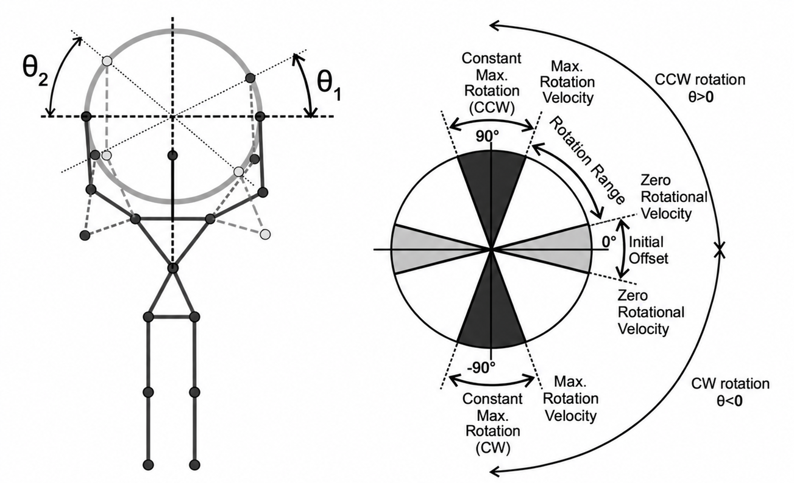</p>


A minimum offset suppresses tracker noise and small unintended movement. A maximum offset clamps the range so a large gesture cannot command an unsafe rotation. What remains maps linearly to rotational velocity, then passes a mean filter of order five before it reaches the base.

### Translational velocity from proxemics

**The robot holds the distance to the teacher that was measured at calibration.** Walking forward closes the gap and the robot accelerates. Stopping restores the gap and the robot stops. The robot therefore reproduces the teacher's own walking pattern rather than an abstract velocity command. A proportional feedback loop on the distance error drives the correction. The robot halts entirely if the teacher gets closer than 30 percent of the reference distance, or if tracking is lost. Robust tracking held over roughly **1.5 to 3.5 metres**. Below a minimum distance $d_{min}$ the robot is stopped over 3 seconds. Between $d_{min}$ and $d_{start}$, velocity is a linear function of distance $d$:
 
$$
V = \frac{-V_{max}}{d_{start}-d_{min}}d + \frac{d_{start}\cdot V_{max}}{d_{start}-d_{min}} = \frac{V_{max}}{d_{start}-d_{min}}(d_{start}-d)
$$

<p align="center">
  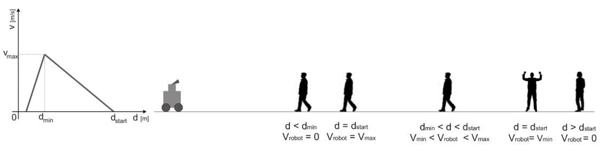
</p>
 
So $V=0$ for $d \ge d_{start}$ or $d \le 0$ outside the working band, $V=V_{max}$ at $d=d_{min}$, and it interpolates linearly in between; this is the calibration curve, not the running controller.
 
The running controller is a PD loop on the distance error, not the open-loop curve above. $d_{start}$ is the reference, the current measured distance $d$ is the feedback, and the error $e = d_{start}-d$ produces a velocity correction $\Delta V$ added to the robot's current velocity:
 
$$
\Delta V = \frac{\Delta V_{max}}{e_{max}}\cdot e, \qquad e_{max}=d_{start}-d_{min}
$$
 
<p align="center">
  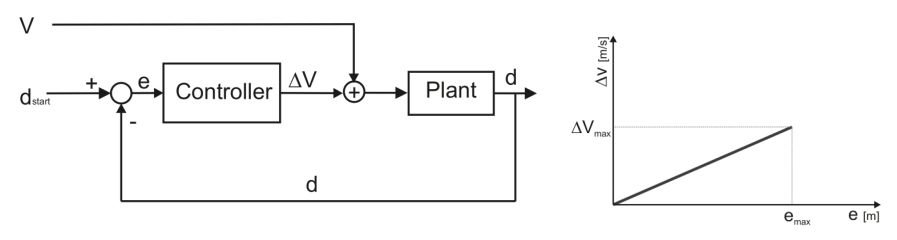
</p>

This closed loop is also what keeps Kinect tracking stable, since tracking error grows with the relative velocity between sensor and subject, so damping the response reduces both overshoot and the chance of losing the user.


#### Safety override: time to collision
 
Sonar gives the distance to the nearest obstacle along the robot's current circle of constant curvature, $d_{curvature}$. This converts to a time to collision at the current velocity:
 
$$
t_o = \frac{d_{curvature}}{V_{robot}}
$$
 
The commanded velocity is capped so that the time to collision never drops below a safety threshold $t_{safe}$:
 
$$
V_{safe} = \min\left(V_{robot}, \frac{d_{curvature}}{t_{safe}}\right)
$$
 
Rotational velocity is left untouched by this override, so the teacher can still steer away from the obstacle even while translation is being held back.

### Active perception: pan and tilt correction
##### Active pan-following control

The Kinect has a narrow field of view, so reliable gesture tracking requires the teacher to remain near the center of the camera image. As the teacher moves and the robot changes orientation, the teacher can otherwise move toward the edge of the image or leave the field of view entirely. To prevent this, the camera orientation is actively adjusted in both pan and tilt throughout the demonstration.

Horizontal correction is performed using an external servo motor mounted below the Kinect and controlled through image-based visual servoing. The image Jacobian is used to convert the pixel error into a pan rate. The error is calculated from the **left and right hand positions** rather than the head, because measurements showed that the head frame was substantially noisier than the hand frames in this tracker. The two hand errors are averaged into a single correction signal and sent to the servo over a serial link, with the pan range limited to plus or minus 90 degrees.
Pan correction:
<p align="center">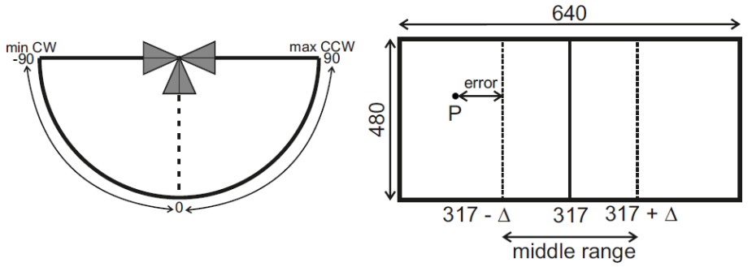 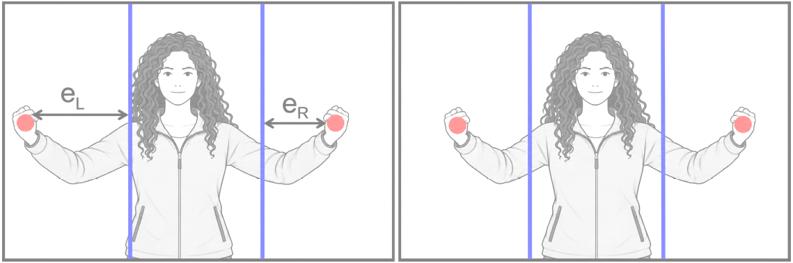</p>

Pan runs continuously, unlike tilt. The servoing error is the standard image-based visual servo form, the gap between the current image feature $s(m(t),a)$ and its desired value $S$:
 
$$
e(t) = s(m(t),a) - S
$$
 
Here the feature is the teacher's position in frame, kept inside a 120-pixel-wide band around the principal point at (317.3, 234.3). The projection of a 3D camera-frame point onto the normalized image plane and its time derivative under camera motion:
 
$$
\begin{cases} x = \dfrac{X}{Z} \\\\ y = \dfrac{Y}{Z} \end{cases}
\qquad
\begin{cases}
\dot{x} = \dfrac{-v_x}{Z} + \dfrac{xv_z}{Z} - (1+x^2)w_y + xyw_x + yw_z \\\\[4pt]
\dot{y} = \dfrac{-v_y}{Z} + \dfrac{yv_z}{Z} + (1+y^2)w_x - xyw_y - xw_z
\end{cases}
, \qquad \dot{x} = L_x \cdot V_c
$$
 
The interaction (image Jacobian) matrix $L_x$:
 
$$
L_x = \begin{pmatrix} \dfrac{-1}{Z} & 0 & \dfrac{x}{Z} & \dfrac{xy}{\lambda} & -(1+x^2) & y \\\\[6pt] 0 & \dfrac{-1}{Z} & \dfrac{y}{Z} & \dfrac{1+y^2}{\lambda} & -xy & -x \end{pmatrix}
$$
 
Full apparent image motion $(u,v)$ for a given pixel, as a function of the six camera velocity components $(v_x,v_y,v_z,w_x,w_y,w_z)$:
 
$$
\begin{pmatrix} u \\\\ v \end{pmatrix} = \begin{pmatrix} \dfrac{-1}{Z} & 0 & \dfrac{x}{Z} & \dfrac{xy}{\lambda} & -(1+x^2) & y \\\\[6pt] 0 & \dfrac{-1}{Z} & \dfrac{y}{Z} & \dfrac{1+y^2}{\lambda} & -xy & -x \end{pmatrix} \cdot \begin{pmatrix} v_x \\\\ v_y \\\\ v_z \\\\ w_x \\\\ w_y \\\\ w_z \end{pmatrix}
$$
 
Only the pan axis exists, so every camera velocity term except $w_x$ is zero:
 
$$
v_x=v_y=v_z=w_y=w_z=0
$$
 
which reduces the servoing law to a single scalar relation between horizontal pixel error and pan rate:
 
$$
\begin{pmatrix} \dot{u} \\\\ \dot{v} \end{pmatrix} = \begin{pmatrix} \Delta u \\\\ 0 \end{pmatrix} = \begin{pmatrix} xy \\\\ \dfrac{1+y^2}{\lambda} \end{pmatrix} w_x
, \qquad
\Delta u = \begin{pmatrix} 0 \\\\ \dfrac{1}{\lambda} \end{pmatrix} w_x
, \qquad
w_x = \lambda \cdot \Delta u
$$
 
The resulting pan rate $w_x$ (angle per second) is integrated into a heading change $\Delta\Psi$, and the servo is commanded to a new absolute heading relative to its last read position:
 
$$
\Psi_{new} = \Psi + \Delta\Psi
$$
 
sent over serial to the Maestro servo controller. Pan travel is limited to -90 to +90 degrees from the zero heading. Left and right hand image positions are used for this error rather than the head position, because the tracker was measured to return substantially noisier head coordinates than hand coordinates.
The left and right hand pixel errors, $e_L$ and $e_R$, are each converted through the visual servoing law above into a pan correction angle, $\Psi_L$ and $\Psi_R$. The final commanded pan angle is the average of the two:

$$
\Psi = \frac{\Psi_R + \Psi_L}{2}
$$

---
##### Active tilt-following control
Vertical correction is performed using the Kinect's internal tilt motor. After the person is detected, the head position is used to determine the required tilt angle so that the teacher is vertically centered before joint tracking begins.

Once tracking starts, pan and tilt correction operate alongside the joint-tracking process. If the teacher moves away from the center of the image or approaches the boundary of the camera's field of view, the camera orientation is updated accordingly. The pan and tilt mechanisms therefore allow the sensor to follow the teacher continuously and maintain a suitable view for gesture recognition throughout the demonstration.
Tilt correction:
<p align="center">
  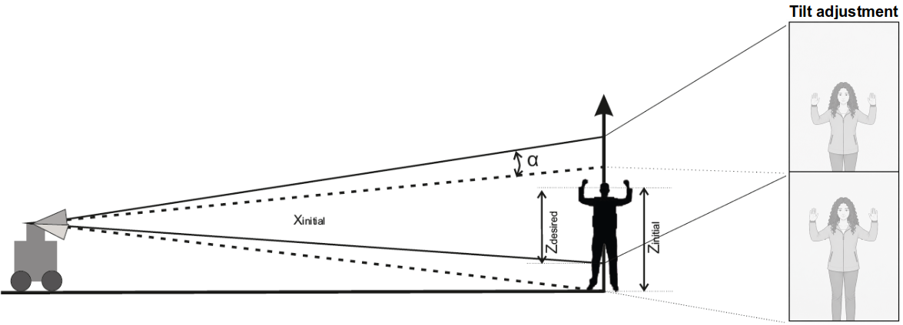
</p>
Tilt is a one-shot correction computed right after calibration, not a continuous loop like pan. From the initial head height in the camera frame and the desired head height in frame, triangulation gives the real distance to the camera:
 
$$
r_{real} = \sqrt{X_{init}^2 - Z_{init}^2}
$$
 
The tilt angle needed to move the head from its initial position to the desired centred position is:
 
$$
\alpha = \arctan\left(\frac{Z_{init}}{r_{real}}\right) - \arctan\left(\frac{Z_{desire}}{r_{real}}\right)
$$
 
This is sent once to the Kinect's internal tilt motor, which has a travel range of -30 to +30 degrees.


### Bidirectional feedback to the human

The interface is not one-way. Audio messages announce state changes and obstacle warnings, and a live view shows the teacher **what the robot currently believes about them**: tracked joint positions, whether they are inside the desired image region, and the velocities being applied right now. Here is a sample demo mode demonstrated below.

<p align="center">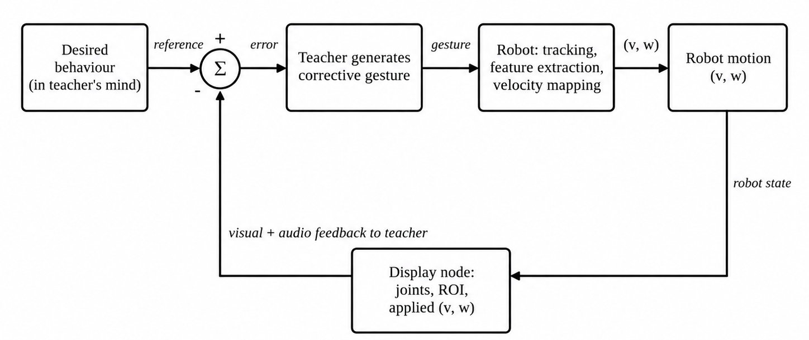 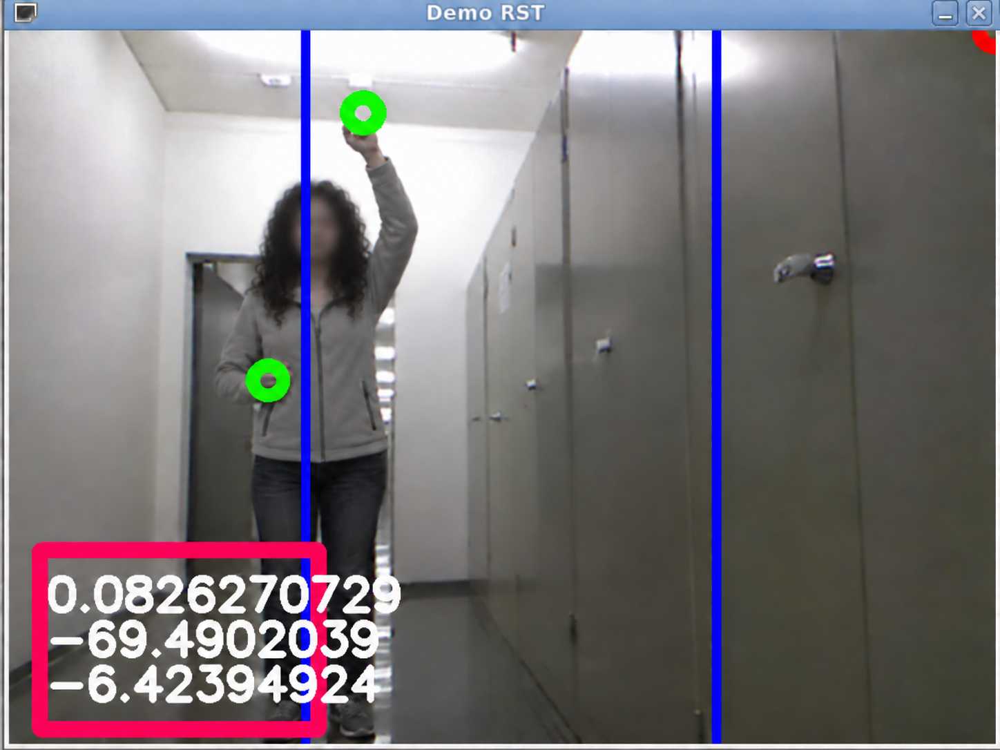</p>


This closes the loop on the human side and is what let non-experts correct their own gestures instead of being told how to stand. It measurably shortened preparation time.

---

## System

<p align="center">
  
</p>

**Three custom ROS nodes:**

| Node | Responsibility |
|---|---|
| `control` | Main loop. Calibration, transform subscription, gesture feature extraction, velocity computation, gaze commands, audio cues, recording trigger |
| `record` | Synchronised logging: sonar, omnidirectional images, pan angles, localization, odometry, teacher distance, gesture state, all system-time tagged |
| `display` | Live operator feedback view |

**Integrated stock packages:** `openni_camera`, `openni_tracker`, `kinect_aux`, `sound_play`, `amcl` for Monte Carlo localization, `ROSARIA` for velocities, odometry and sonar, `camera1394` for the omnidirectional camera, `image_view` and `rviz`. Everything is brought up from one launch file.

**Hardware:** Pioneer 3-DX differential drive base, Microsoft Kinect, HS-645MG servo with a Pololu Mini Maestro 12 controller for the pan axis, Kinect internal tilt motor, sonar ring, laser scanner for mapping and localization, catadioptric omnidirectional camera over FireWire, onboard laptop.

**Stack:** C++ on ROS for everything real time, MATLAB for offline analysis of the recorded demonstrations.

### Omnidirectional imaging for the teleoperation mode

The third interface streams the robot's own catadioptric image to a remote operator. Raw omnidirectional images are hard for humans to navigate from, so the image is **unwarped into a bird's-eye view by radial correction around the image centre**, which restores geometric consistency. Corridors then appear as bands of constant width.

<p align="center">
  
</p>

<p align="center">
  
</p>

Image data and motion commands travel over a TCP/IP client-server link. Loss of communication beyond a timeout stops the robot.

---

## Experiments

**Seven navigation behaviors** were demonstrated in a real office building, not in simulation: straight line, curved line, slalom, corridor following, obstacle avoidance, door passing and homing.

<p align="center">
  
</p>

**Fifteen volunteers** with varying levels of programming and robotics knowledge participated, each given at most ten minutes to become acquainted with all three interfaces. Conditions were checked before every run to keep them comparable across users. Laser-based Monte Carlo localization provided absolute robot coordinates in the map, and odometry was logged in parallel.
  
**Performance measures:** average time to complete the task, total number of velocity commands, average translational velocity, average curvature of the demonstrated trajectory, and the dispersion of the curvature distribution as a smoothness measure. Curvature is the ratio of commanded rotational to translational velocity, which decouples the shape of the demonstration from the speed at which it was performed and lets fast and slow runs be compared directly.

---  
## Per-behaviour validation  

The final phase of the project validates each demonstrated behaviour individually: the recorded trajectory is checked against the intended path, and the relevant velocity or orientation signal is checked against what the task required. Straight line and curve line are shown below as examples; the same validation was carried out for all seven behaviours.

### Straight line

<p align="center">
  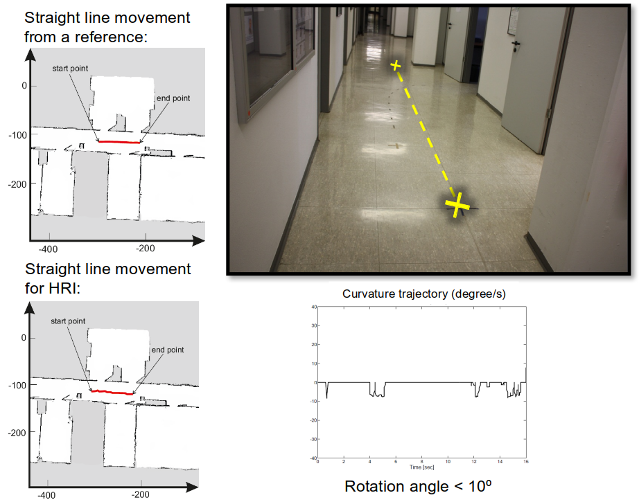
</p>

The robot's position was logged two ways during the run: from the laser-based localization system, taken as the reference, and from the robot's own wheel odometry, which is the estimate actually available to the onboard controller in real time. The two agree closely, both tracing a straight path from the marked start point to the marked end point in the corridor shown in the photo. The robot's orientation stayed close to constant through the run, and the curvature of the path, $V_{rot}/V_{trans}$, stayed within roughly ±10 rad/m of zero for the full 16 seconds, confirming the deviation from a straight line was negligible. Rotational velocity was correspondingly close to zero throughout, since the task only required the teacher to change the translational velocity.

### Curve line

<p align="center">
  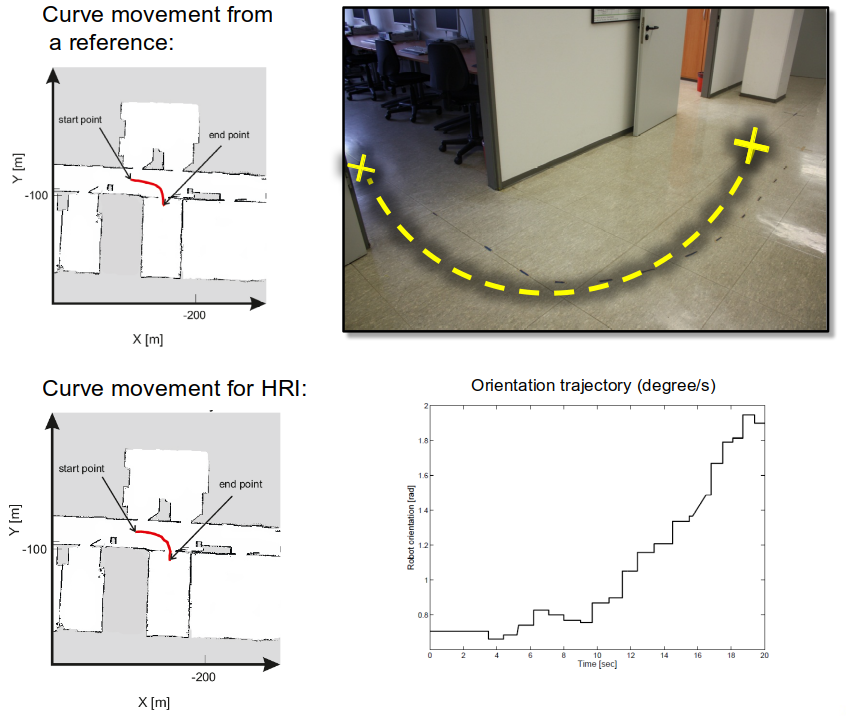
</p>

The curve task required roughly a quarter turn, $\pi/2$ rad, between the marked start and end points. The recorded orientation trajectory increased from about 0.5 rad to about 1.9 rad over the 20 second demonstration, a change of about 1.4 rad (80.2°), close to the intended turn. Rotational velocity swung negative to drive the clockwise turn and returned to zero once the heading change was complete, while the steering angle demonstrated by the teacher peaked at about 1.1 rad. Translational velocity stayed roughly steady across the same interval, meaning the turn was driven while the robot kept moving rather than by stopping and rotating in place.


---

## Results

### Time to complete the task

<p align="center">
  
</p>

### Number of commands issued

<p align="center">
  
</p>

### Smoothness of the recorded demonstrations

<p align="center">
  
</p>

**interpretation:**

- **The gesture interface produced the least noisy demonstration data of the three.** Since the point of the exercise is training data for Learning from Demonstration, this is the result that matters most.
- **Joystick demonstrations were the noisiest.** Holding a translational velocity steady while simultaneously applying rotation is something humans do badly with a joystick, and non-experts degrade sharply. Joystick is the fastest interface to pick up, and the fastest to finish a task, but not the one that produces the best data.
- **Steering wheel teleoperation was consistently the slowest**, especially on medium complexity behaviors like slalom and door passing, because the operator has no direct view of the robot and no depth cue from the camera image.
- **Gesture demonstration performed consistently well even with non-experts**, after a short preparation period.


<summary><b>Detailed per-behavior tables from the thesis</b></summary>

<br>

These tables are taken from the thesis, which reports selected demonstrations per behavior. The bar plots above aggregate over the full participant group, so the two sets of figures are not directly comparable.

Average completion time in seconds:

| Behavior | Joystick | Steering wheel | Gesture HRI |
|---|---|---|---|
| Straight line | 9.91 | 76.42 | 26.88 |
| Curve line | 5.0 | 9.43 | 31.0 |
| Slalom | 28.8 | 24.4 | 53.15 |
| Corridor following | 62.80 | 148.51 | 59.65 |
| Obstacle avoidance | 11 | 51.7 | 37.7 |
| Homing | 24.73 | 48.14 | 24.97 |
| Door passing | 29.8 | 77 | 30.77 |

Average number of commands:

| Behavior | Joystick | Steering wheel | Gesture HRI |
|---|---|---|---|
| Straight line | 1 | 1 | 3 |
| Curve line | 5 | 5 | 8.6 |
| Slalom | 8 | 52 | 14.5 |
| Corridor following | 5 | 22 | 45 |
| Obstacle avoidance | 9.5 | 9 | 11.4 |
| Homing | 5.3 | 10 | 2.25 |
| Door passing | 7.6 | 10.5 | 10 |

Joystick figures are for expert users. Where non-expert results diverged sharply the thesis reports them separately: corridor following took 283.7 seconds for non-experts against 62.80 for experts, and curved line took 13.0 against 5.0.

Variance of the curvature distribution, lower meaning a smoother path:

| Behavior | Joystick (expert) | Joystick (non-expert) | Steering wheel | Gesture HRI |
|---|---|---|---|---|
| Straight line | 0 | | 0 | 28.5 |
| Curve line | 5191 | 1923 | 958 | 364 |
| Slalom | 231 | | 2429 | 758 |
| Corridor following | 432 | 10723 | 654 | 575 |
| Obstacle avoidance | 13396 | | 47360 | 10520 |
| Door passing | 2301 | | 2399 | 2542 |


---

## What this project demonstrates

- **Complete robotics pipeline delivered on physical hardware**, from RGB-D perception through coordinate transformations, feature extraction and control, to a moving differential drive base, with no simulation stage in between.
- **Real-time closed-loop control** under the latency budget of a 30 Hz sensor, including an inner visual servoing loop on the camera pan axis.
- **Image-based visual servoing** implemented from the image Jacobian, not taken from a library.
- **Multi-sensor integration**: RGB-D, laser, sonar, wheel odometry, catadioptric camera, servo feedback, on one platform under ROS.
- **Sensor characterisation driving design**, for example measuring that head-frame tracking was less reliable than hand-frame tracking and reworking the gaze error around that instead of trusting the API.
- **Safety layer independent of the command source**, so a wrong or malicious command cannot drive the robot into an obstacle.
- **Experiment design and user study** with fifteen participants, quantitative metrics, and a questionnaire, followed by statistical analysis of the recorded runs.
- **Framing a human-robot interaction problem as a data quality problem**, which is the correct framing for imitation learning.


## Project capabilities and key outcomes

- **End-to-end robotics implementation on physical hardware**, covering RGB-D perception, coordinate transformations, feature extraction, control, and execution on a differential-drive mobile robot without an intermediate simulation stage.
- **Real-time closed-loop operation** within the timing constraints of a 30 Hz sensing pipeline, including a visual servoing loop for active camera pan control.
- **Image-based visual servoing from first principles**, with the control law derived from the image Jacobian rather than relying on a pre-built library implementation.
- **Integration of multiple sensing and feedback modalities** under ROS, including RGB-D, laser, sonar, wheel odometry, a catadioptric camera, and servo feedback.
- **Sensor-driven system design**, where measured tracking performance directly influenced the implementation. For example, the lower reliability of the head frame compared with the hand frames led to reformulating the gaze-error signal around the hand positions.
- **An independent safety layer for obstacle avoidance**, separating collision prevention from the source of the motion command so that unsafe commands cannot directly drive the robot into an obstacle.
- **Experimental evaluation with fifteen participants**, combining quantitative performance measures with questionnaire-based feedback and statistical analysis of the recorded trials.
- **Treatment of human-robot interaction as a demonstration-quality problem**, with the interface designed to improve the consistency and usefulness of the data collected for Learning from Demonstration.


---

## Related publication

This thesis formed the basis of the following publication by the institute, where the gesture-based demonstration mode,
including its implementation and experimental evaluation, was developed within the scope of this work, the paper draws on the work in this thesis, and the thesis is the primary and complete record of it.

> _K.K. Narayanan, L.F. Posada, F. Hoffmann and T. Bertram, “Human-Machine Interfaces for Intuitive and
Effective Demonstrations of Mobile Robot Behaviors,” in Proceedings of the 22. Workshop Computational
Intelligence, KIT Scientific Publishing, Dortmund, 2014, Band 45, p. 427._


---

## Repository contents


```
ros/
  HRI_Gesture_Demo/          main package: gesture control, recording, display
    src/                     control_node, display_node, record_node, tf_listener_example
    src/earlier_versions/    two earlier stages of control_node, kept for reference
    launch/                  one launch file per run configuration
    scripts/                 shell scripts that invoke the launch files
  ROSARIA/                   Pioneer base driver, patched with odometry_tf_broadcaster
  kinect_aux/                Kinect tilt motor node
  learning_image_geometry/   stock package config, unmodified
  pioneer_tf/                standalone TF broadcaster
  teleop_base/                joystick/pedal teleoperation, two publisher variants
  config/                    map file for the demo environment
  setup/                     one-time environment setup scripts

matlab/
  gesture_pipeline/          steering angle, hand distance, image projection, filtering
  dataset_analysis/          batch analysis of recorded demonstration logs
  steering_wheel_gui/        remote teleoperation GUI (client/server)
  sick_laser_interface/      laser serial protocol driver
  particle_filter_sim/       Monte Carlo localization coursework, separate from the thesis

tools/
  servo_serial/              pan servo serial control (C++)
  kinect_windows_mex/        Windows-only Kinect capture, MEX + Visual Studio project

docs/images/                 figures used in this README
```
---
## License
**License:** CC BY-NC-ND 4.0 — https://creativecommons.org/licenses/by-nc-nd/4.0/ See `LICENSE`.
